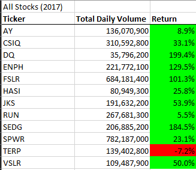
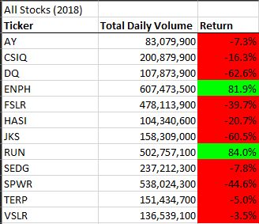

# Stock Analysis

## Overview
Introduction into VBA by analyzing stocks from 2017 and 2018 for the UW-Extended Campus's Data Analytics Bootcamp.

## Results
### 2017

As we can see, most of the stocks had a return on investment. 

DQ, ENPH, FSLR, and SEDG more than double in value.

### 2017

## Summary
The advantage of refoactoring code is to reduce techinical debt, more readable code, and can make it faster.

The major disadvantage is the fact it takes time to refactor code and managers really don't care about tech debt (it's not owed to the bank, so why care?).

The orginal code is a easier to read, however, it iterates of the rows multiple times, which can consume time.

The refactored code only iterates through all the rows once. However, I had to match up arrays and play the "am I in the correct index for all 3 arrays" game. I am saddened that maps/dictionaries where not taught.